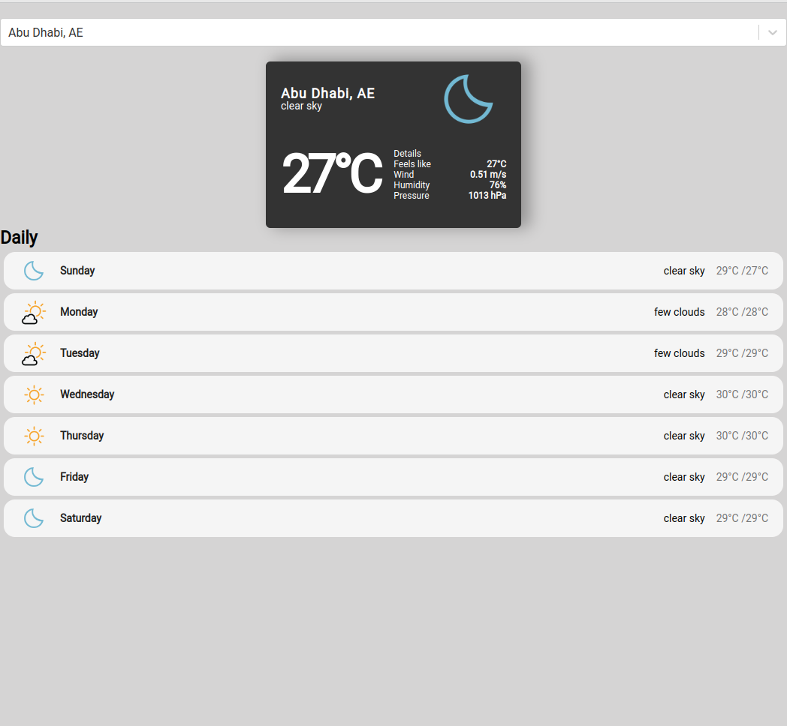
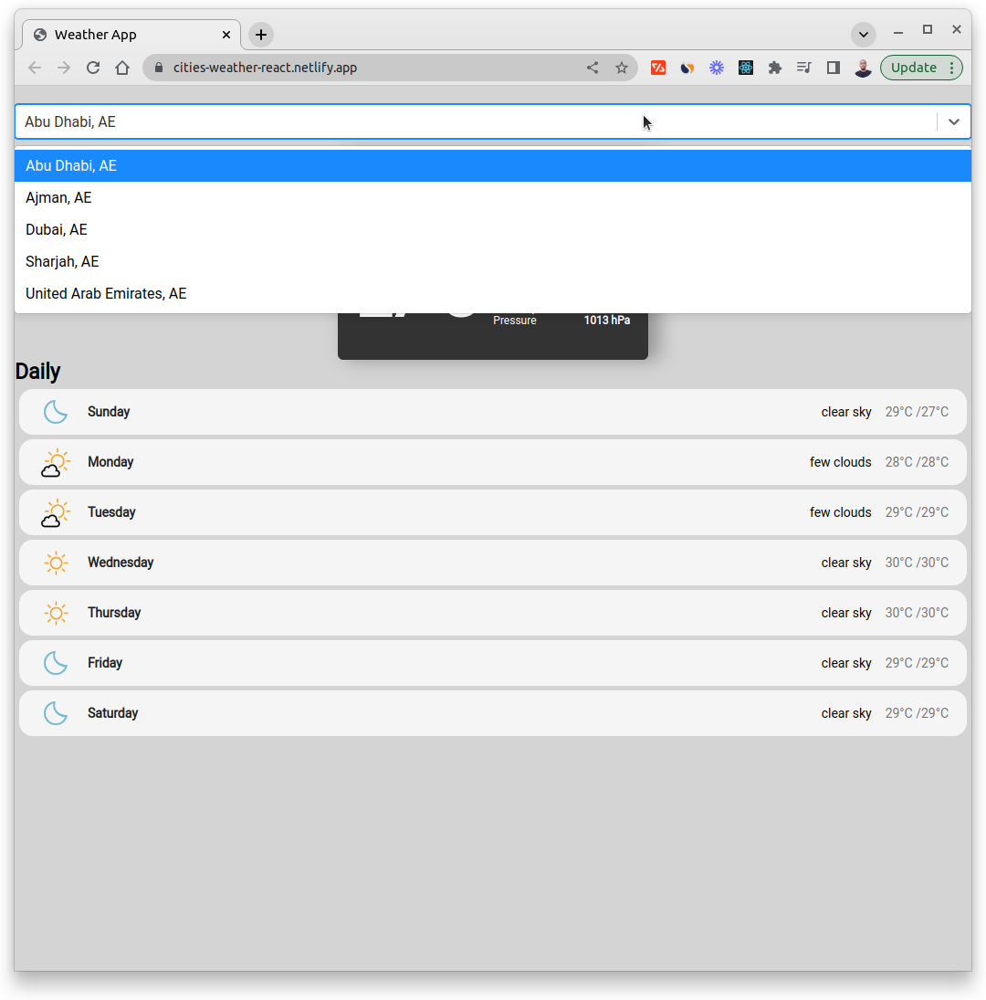
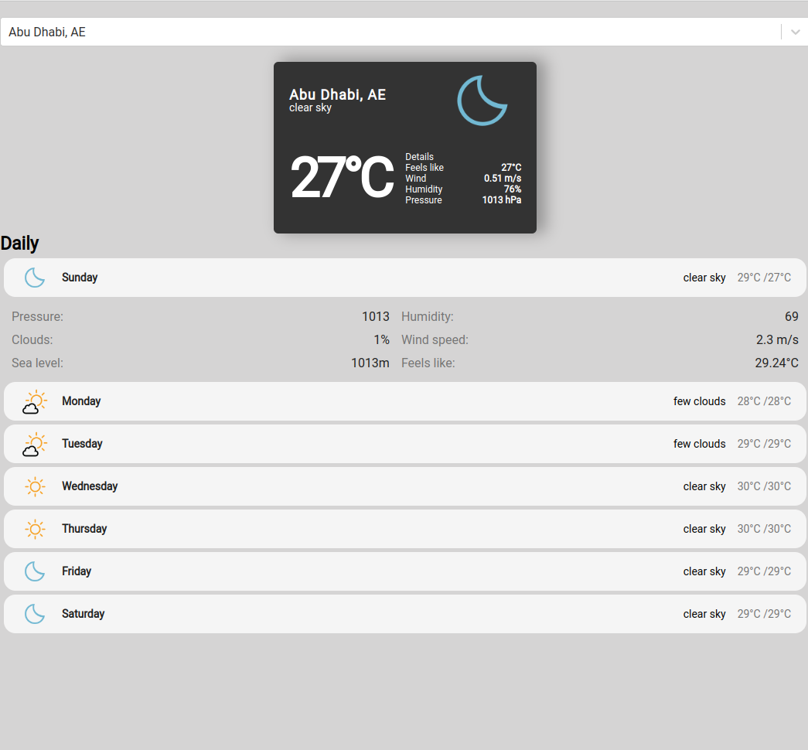

# Weather App

[](https://cities-weather-react.netlify.app/)

[](https://cities-weather-react.netlify.app/)

[](https://cities-weather-react.netlify.app/)

Weather App with City auto-completion in React

## Technologies

- [`React`](https://reactjs.org/)
- [`OpenWeather`](https://openweathermap.org/)
- [`GeoDB Cities`](https://rapidapi.com/wirefreethought/api/geodb-cities/)

## Setup

```code
# Clone this repo
git clone https://github.com/hesbon-osoro/weather-app.git

# Navigate to directory and install packages
cd weather-app && yarn

# Start the App
yarn start
```

[](https://www.buymeacoffee.com/wazimu)
